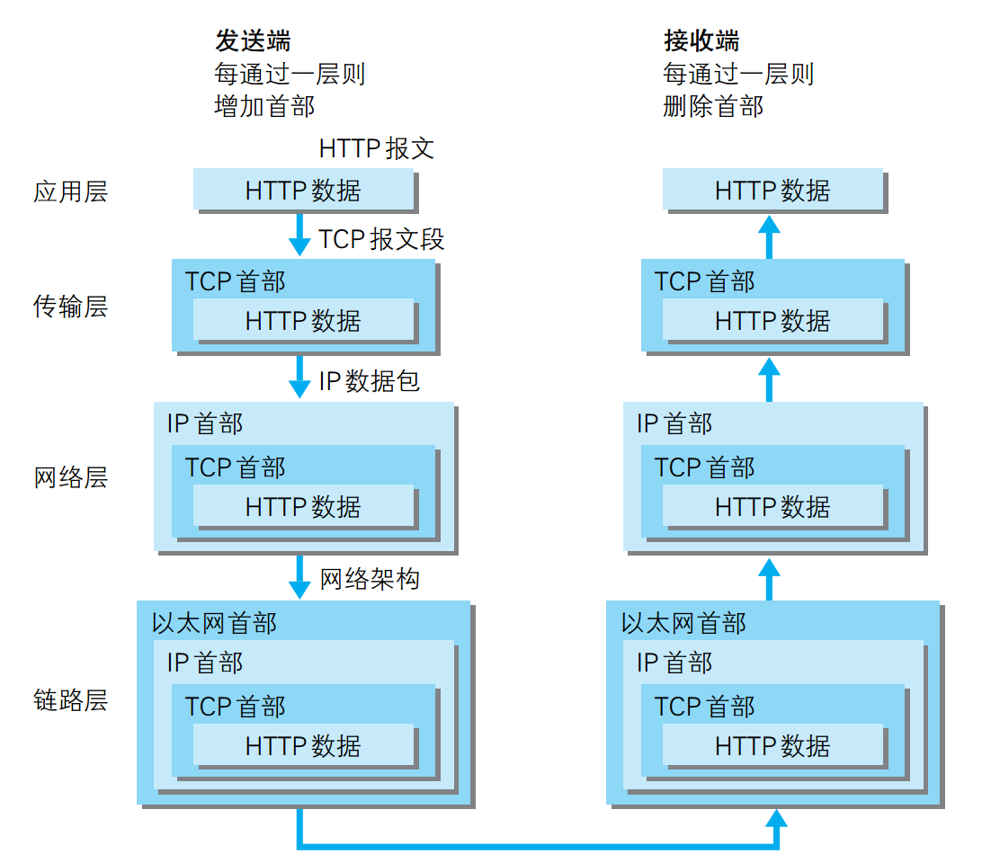

# 图解HTTP

## 1. Web及网络基础

#### Web是建立在HTTP协议上通信的：
根据指定的URL，客户端（client）发送请求从服务器（server）获取文件资源（resource）等信息，从而显示出Web页面。

#### HTTP版本：
0. HTTP/0.9
1. HTTP/1.0发布于1996年5月，HTTP正式称为标准
2. HTTP/1.1发布于1997年1月，是对HTTP/1.0的修订，采用了持久连接，还支持以管道方式（pipelining）在同时发送多个请求
3. HTTP/2（原命名为HTTP/2.0）于2015年5月发布（在本书出版之后）
4. HTTP/3 将会是第三个主要版本的HTTP协议

> The standardization effort was supported by Chrome, Opera, Firefox, Internet Explorer 11, Safari, Amazon Silk, and Edge browsers. [Most major browsers](https://en.wikipedia.org/wiki/Comparison_of_web_browsers#Protocol_support) had added HTTP/2 support by the end of 2015.([Wikipedia](https://en.wikipedia.org/wiki/HTTP/2))

#### TCP/IP基础

TCP/IP通常指**TCP/IP协议族**（英语：TCP/IP Protocol Suite，或TCP/IP Protocols），是互联网相关的各类协议族的总称。

TCP/IP分为4层：**应用层、传输层、网络层和数据链路层**。HTTP协议处于*应用层*。

HTTP请求在各层的 **封装（encapsulate）** 过程如下图：

